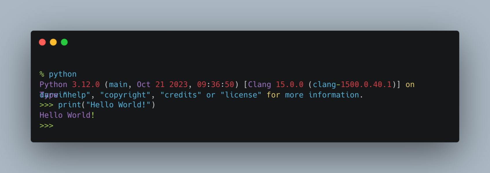

  

<h1 align="center">Gabriel Dias — Automação • Python • API • UX • IVR • AGI</h1>

  
  
  
  
  
  
  
  
  
  
  

### Sobre mim
Analista de **URA/IVR e Canais Digitais**. Desenho experiências de atendimento (UX), **crio URAs em Low Code usando JSON**, integro **APIs REST/SOAP** (WhatsApp, e-mail, CRMs e gateways), e automatizo rotinas com **Python** e **PHP (AGI/Asterisk)**. Documentação técnica em **UML**, foco em confiabilidade, monitoramento e métricas.

- **LinkedIn:** https://www.linkedin.com/in/gabriel-dias-833326153/

### O que eu entrego
- Soluções de Voz & Canais Digitais **end-to-end** descoberta + análise de requisitos → arquitetura & UX (fluxos/diagramas, protótipos) → especificação de APIs → implementação & integrações → testes & QA → homologação, versionamento, entrega com documentação e treinamento.
- **URA/IVR gráficos** e **flows Low Code (JSON)** com roteamento, validações e contingência.
- **Integrações** REST/SOAP (Asterisk/AGI, WhatsApp, e-mail, CRMs) com autenticação, retentativas, logs e tratamento de erros.
- **Automações com Python**: bots, scripts, webhooks e tarefas recorrentes.
- **Automação de WhatsApp, URA/IVR e e-mail**: disparos, templates, recepção de eventos, orquestração e handover.
- **APIs & Backends** (Python/FastAPI, PHP/AGI) com **PostgreSQL** e jobs assíncronos.
- **Versionamento & Qualidade**: Git e testes.
- **Segurança & LGPD**: mascaramento de dados, auditoria e boas práticas.
- **Documentação & Treinamento**: UML, guias operacionais para times.

### Projetos em destaque
- **Faturamento Médico (MVP)** — Back: FastAPI + JWT + PostgreSQL. Front: HTML + CSS + JS
  Automação de cobrança por e-mail com follow-ups, leitura de respostas e painel de acompanhamento.

### Stack & Interesses
`Python` · `FastAPI` · `PHP (AGI/Asterisk)` · `PostgreSQL` · `Canais Digitais` · `UX Designer` · `Automações URA & Canais Digitais` · `UML Diagramas` · `Low Code` · `JSON` · `ETL/BI` · `Segurança`

### Contato
- **E-mail:** gabrielhfdias@outlook.com  

